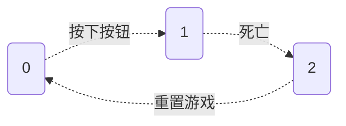

 

 

 
 
 
 
 

数字逻辑设计：课程报告
 

基于数字系统的Flappy Bird游戏
 

<strong>作者：陈希尧</strong>
 

<strong>日期</strong>：2019年12月26日
 

 
目录

[TOC]

## Thoughts

## Design

### 重要参数说明

在各个模块中同名的参数，为了适应各模块功能，其类型可能不一定相同。

#### 逻辑相关

**State**

用于记录当前状态，有三个状态，可以以如下条件进行转换。

对于其状态的切换是在顶层模块`Top_FlappyBird`中进行的

**isDead**

在`Bird_Ctrl`中进行死亡判断，并一直传递回顶层模块，

#### 显示相关

**RGB_R, RGB_G, RGB_B**

在Display中是`wire`类型，记录当前像素(行列作标分别为`Y_Addr`, `X_Addr`)处的颜色信息，并传递给`vgac`模块进行颜色显示。

### 重要模块说明

#### Display

#### Bird_Ctrl

**功能**

* 进行撞击判断鸟是否已死，修改`isDead`并传回
* 控制鸟的速度大小与方向进而改变其垂直位置并输出回`Display`
* 

#### Pipe_Generator

**功能**

* 记录已通过的管子数作为分数`score`作为输出回传到`Display`进行显示

## Debugging Logs

### VGA Display

1. 我第一次上板验证的情况是这样的：

   

   颜色和所调用的图层的颜色是一样的，但是位置和图案显然错误。初步猜测这是由于扫描同步失败导致的，进而检查自己的源码，首先是`vgac`的检查，然而在之前的测试中，`vgac`是可以正常使用的，因此并不是造成事故的原因

### 

## 

