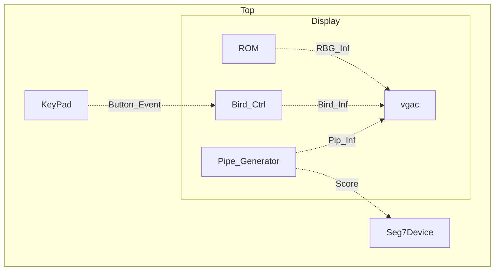
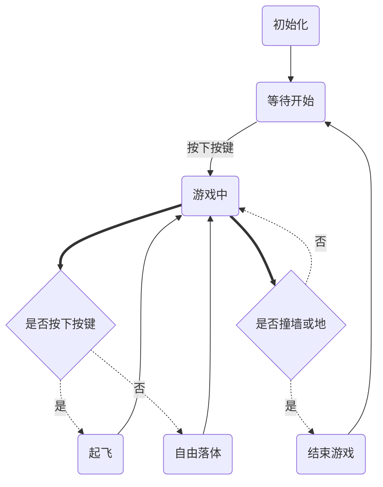
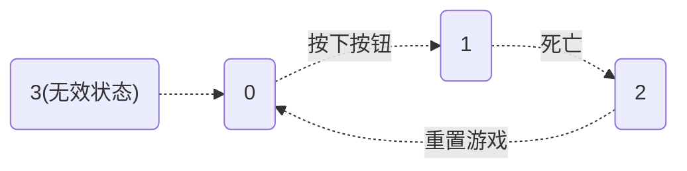

<br/>

<center></center>
<br/>

<center></center>
<br/>
<br/>
<br/>
<br/>
<br/>

<center style="font-size:2.5rem;font-weight:bold">数字逻辑设计：课程报告</center><br/>
<center style="font-size:2rem;font-weight:bold">基于数字系统的Flappy Bird游戏</center><br/>
<center style="font-size:1.5rem"><b>作者</b>：<u>&ensp;陈希尧&ensp;</u>&emsp;<b>学号</b>：<u>&ensp;3180103012&ensp;</u>&emsp;<b>专业</b>：<u>&ensp;混合班&ensp;</u></center><br/>
<center style="font-size:1.5rem"><strong>日期</strong>：<u>&ensp;2019年12月26日&ensp;</u></center><br/>
<div STYLE="page-break-after: always;"></div>
<br><center><font size = "5" color = "0xAAAAEE">目录</font></center>

[TOC]

# 第一章-绪论


# 第二章-设计思路与原理

## 2.1 原理

1. **VGA显示**

   VGA(Video Graphics Array)，信号类型为模拟类型，显示卡端的接口为15针母插座.VGA( Video Graphics Array)作为一种标准的显示接口得到了广泛的应用。VGA 在任何时刻都必须工作在某一显示模式之下，其显示模式分为字符显示模式和图形显示模式。而在应用中，讨论的都是图形显示模式。工业标准的 VGA 显示模式为:640\*480\*16色\*60Hz。

   常见的彩色显示器一般都是 CRT(阴极射线管)构成，其引出线共含 5 个信号:R,G,B(3基色信号),HS(行同步信号),VS(场同步信号).由 R,G,B3 种基色可以组合出任意所要的颜色.在实验的验证阶段可以仅利用 R,G,B3 种基色的一元化值(0 和 1)的不同组合来验证设计的正确性。每一个像素的色彩由 R(红，Red) .G(绿，Green). B(蓝，Blue)三基色构成。显示时采用的是逐行扫描的方式。由VGA 显示模块产生的水平同步信号和垂直同步信号控制阴极射线管中的电子枪产生电子束，轰击涂有荧光粉的屏幕，产生 RGB三基色，于显示屏上合成一个彩色像素点。LCD 显示器虽然显示原理与 CRT 不同，但是控制方式和控制信号却是相同的，所以针对 CRT 设计的控制器也可以应用到 LCD 显小器中。

   电子束扫描一幅屏幕图像上的各个点的过程称为屏幕扫描。现在显示器都是通过光栅扫描方式来进行屏幕扫描。在光栅扫描方式下，电子束按照固定的路径扫过整个屏幕，在扫描过程中通过电子束的通断强弱来控制电子束所经过的每个点是否显示或显示的颜色，电子枪在 VGA 显示模块产生的行同步、场同步等控制信号的作用下进行包括水平扫描、水平回扫、垂直扫描、垂直回扫等过程。光栅扫描的路径通常为:从上到下扫过每一行，在每一行中从左到右地进行扫描。其过程如下:电子束从屏幕左上角开始向右扫，当到达屏幕的右边缘时，电子束关闭(水平消隐),并快速返回屏幕左边缘(水平回扫)，然后在下一条扫描线上开始新的一次水平扫描。一旦所有的水平扫描均告完成，电子束在屏幕右下角结束并关闭(垂直消隐)，然后迅速返回到屏幕的左上角(垂直回扫)，开始下一次光栅扫描。VGA 时序控制模块是本设计的重要部分，最终的输出信号行、场同步信号必须严格按照VGA 时序标准产生相应的脉冲信号。对于普通的 VGA 显示器，其引出线共含 5 个信号:G,R,B(3 基色信号),HS(行同步信号)，VS(场同步信号)。在 5 个信号时序驱动时，时序信号包括前两个，它们都有图像显示区和图像消隐区，图像消隐区又分为消隐前肩、同步脉冲区和消隐后肩。


# 第三章-设计实现

## 3.1 设计大纲

### 3.1.1 整体设计方案

**模块功能**



**工作流程图**



### 3.1.2 显示

**图层设置**

* 设计四个图层，分别显示**鸟**，**地面**，**管**，**背景**。且这四者按优先级从高到低排列，若优先级高的被显示了，则优先级较低的无法显示。描述如下：

  ```verilog
      // Procedure: bird > land > pipe > bg, skip the bird
      always @(posedge clk_VGA) begin
          if(inBird && Opacity_Bird)
              {BGR_B,BGR_G,BGR_R} <= BGR_Bird;
          else if(inLand)
              {BGR_B,BGR_G,BGR_R} <= BGR_Land;
          else if(inPipe && (Opacity_up || Opacity_down)) begin
              if(Y_Addr > pip1_Y && Opacity_down)
                  {BGR_B,BGR_G,BGR_R} <= BGR_downPip;
              if(Y_Addr < pip1_Y - slot_height && Opacity_up)
                  {BGR_B,BGR_G,BGR_R} <= BGR_upPip;
          end
          else
              {BGR_B,BGR_G,BGR_R} <= SW_OK[SW_BG] ? BGR_Night : BGR_Day;
      end
  ```

**翅膀的扇动**

* 两种颜色的鸟分为4个状态，利用三张图片往复循环显示实现扇动翅膀的效果

* 状态由`clk_wing`控制，状态图如下：

  ```mermaid
  graph LR
  0("0：翅膀在上")
  1("1：翅膀在中")
  2("2：翅膀在下")
  3("3：翅膀在中")
  0 --> 1 --> 2 --> 3 --> 0
  ```

* 由于三个状态鸟的翅膀位置不同，因此bird这一图层的<u>颜色信息</u>和<u>不透明边界</u>会随着扇翅的进行而不断变化，因此也需要实时刷新RGB信息和透明度信息。

**地面的移动**

* 实现地面随管一同移动的效果，需要在计算地址时能够实现地面地址的跨边缘计算。这一点的实现只需在计算ROM读取地址时采用条件语句即可

## 3.1 设计说明

### 3.1.1 重要参数说明

注：<u>在各个模块中同名的参数，为了适应各模块功能，其类型可能不同。</u>

#### 逻辑相关

**State**

用于记录当前状态，有三个状态(0, 1, 2)，可以以如下条件进行转换。



对于其状态的切换是在顶层模块`Top_FlappyBird`中进行的

**isDead**

在`Bird_Ctrl`中进行死亡判断，并一直传递回顶层模块，用于状态改变。

**Bird_VPos**

用于记录鸟的垂直(由于鸟的水平位置是作为`parameter`限定死的，因此不需要单独存储)

#### 显示相关

**BGR_R, BGR_G, BGR_B**

在Display中是`wire`类型，记录当前像素(行列作标分别为`Y_Addr`, `X_Addr`)处的颜色信息，并传递给`vgac`模块进行颜色显示。

**BGR_Bird, BGR_Land, BGR_upPipe, BGR_downPip, BGR_Day, BGR_Night**

视具体情况决定是`reg`还是`wire`，分别存储个图层在当前位置的颜色信息，并通过判断，决定将哪一组颜色传给`BGR_R, BGR_G, BGR_B`。

**inBird, inLand, inPipe**

均为`wire`类型，存储通过逻辑判断当前位置是否落入某一图层的显示域的结果。后续再结合各图层的优先级即可判断当前像素所在图层。

**clk_wing**

`reg [1:0]`类型，用于存储当前鸟挥翅膀的状态，状态图如下：


这样既能实现翅膀循环往复扇动的效果，又能防止因意外出现无效转态而导致的锁死

****

### 3.1.2 重要模块说明

**Display**

* 控制所有与VGA显示相关的实现，包括图像的生成，鸟和水管的位置的改变等等

**Bird_Ctrl**

* 接受按钮信息，控制鸟的速度大小与方向进而改变其垂直位置并输出回`Display`
* 进行撞击判断鸟是否已死，修改`isDead`并传回`Top`

**Pipe_Generator**

* 在前一根管子完全生成新的管子，并控制这一管子在屏幕上横向移动(通过控制两管间开口的右上角的平移实现)
* 记录已通过的管子数作为分数`score`作为输出回传到`Display`进行显示


# 第四章-调试

## 4.1 VGA 显示

1. 我第一次上板验证的情况是这样的：

   

   颜色和所调用的图层的颜色是一样的，但是位置和图案显然错误。初步猜测这是由于扫描同步失败导致的，进而检查自己的源码，首先是`vgac`的检查，然而在之前的测试中，`vgac`是可以正常使用的，因此并不是造成事故的原因。

   接着仔细观察图形特征，发现其实是由多个背景图**拼贴**而成，且具体轮廓符合但是**颜色**不对且图片是**倒置**的。经过仔细发现发现三个问题如下：

   1. PNG中图像是以BGR形式存储，因此转成的coe也是BGR的形式，我没有注意到这一点，导致图像的R值与B值反接。
   2. VGA扫描是从上至下、从中扫描，而计算时的XY坐标是从下至上的，因此图像会倒置。
   3. 由于背景图的分辨率仅有160×120，因此计算时需要有相应的缩放处理，我在纵坐标的缩放时出错了，所以导致显示了多张背景图。

2. 解决了上述问题之后，能够正常显示了，但是四个图层中只有最下一层背景能显示，而其他三个部分无法出现，如下图

   

   仔细检查了`Display`部分代码，发现是犯了漏加如下一处`begin...end`的低级错误，由于漏加这个判断，因此无论前面图层的条件是否成立都会被最后的背景图层覆盖。

   ```verilog
       always @(posedge clk_VGA) begin
           if(inBird && Opacity_Bird)
               {BGR_B,BGR_G,BGR_R} <= BGR_Bird;
           else if(inLand)
               {BGR_B,BGR_G,BGR_R} <= BGR_Land;
           else if(inPipe) /*begin*/
               if(Y_Addr > pip1_Y)
                   {BGR_B,BGR_G,BGR_R} <= BGR_upPip;
               if(Y_Addr < pip1_Y - slot_height)
                   {BGR_B,BGR_G,BGR_R} <= BGR_downPip;
           /*end*/
           else
               {BGR_B,BGR_G,BGR_R} <= SW_OK[SW_BG] ? BGR_Night : BGR_Day;
       end
   ```

3. 解决了以上问题之后再测试时，管子的显示出现如下异常：

   

   经检查发现这是在计算传给图像ROM的地址时出错导致的，由于本实验中多个图层都涉及了**图像的缩放**，因此和容易出现缩放的错误。此处是因为控制水管的图片的ROM的地址大小为20×12的，而显示时将其宽度乘以3扩大到60，缩放没有计算正确而导致的。修改后即可。


## 4.2 逻辑控制

1. 鸟的控制按钮

   本来预期功能是按下一次键盘鸟获得一个向上的初速度，但实际上变为按下之后鸟才有下落的反应，并且松开后马上回到未开始的状态。
   
2. 死亡后无法初始化的问题

   发现鸟死后无论怎么按重置按钮鸟都留着不动，发现是状态切换的描述部分没有使用`else if`，这就导致了`state`被置0后由于`isDead`还未来得及清零马上又将`state`置为2，修改为以下之后即可正常使用。

   ```Verilog
       always @* begin
           if(rst)
               state <= 0;
        else if(isDead)
               state <= 2;
        else if(up_button)
               state <= 1;
       end
   ```
   
   
   
3. 鸟的瞬移问题

   发现在鸟水平速度为0的瞬间鸟会向下瞬移一定长度。经检查发现是由以下原因共同造成

   * 初始化时给鸟的方向设定是朝上即`velocityDire == 1`
   * 鸟的方向改变语句是`if(velocity == 0 && velocityDire == 1)  velocityDire <= 0;`
   * 鸟的速度(无符号数)改变语句是`velocity <= velocityDire ? velocity - 1 : velocity + 1;`
   * 这个部分的语句均采用非阻塞赋值

   由于是非阻塞赋值，因此鸟的速度变化时`velocityDire`仍为1，因此速度改变语句执行的命令是``velocity <= velocity - 1;`，但由于此时velocity已经为0了，因此会溢出变为有符号的-1即无符号的5'b11111，由于位置改变语句`V_pos <= velocityDire ? V_pos + velocity : V_pos - velocity;`会直接将位置减去速度最大值，因此效果就好像瞬移。

   将初始化的鸟的方向设定为朝下并将该always语句中的赋值语句全部改为非阻塞即可。

# 第五章-实验结果


# 第六章-总结


# 附录

## 源代码

### Top_FlappyBird.v

### Display.v

### Bird_Ctrl.v

### Pipe_Generator.v