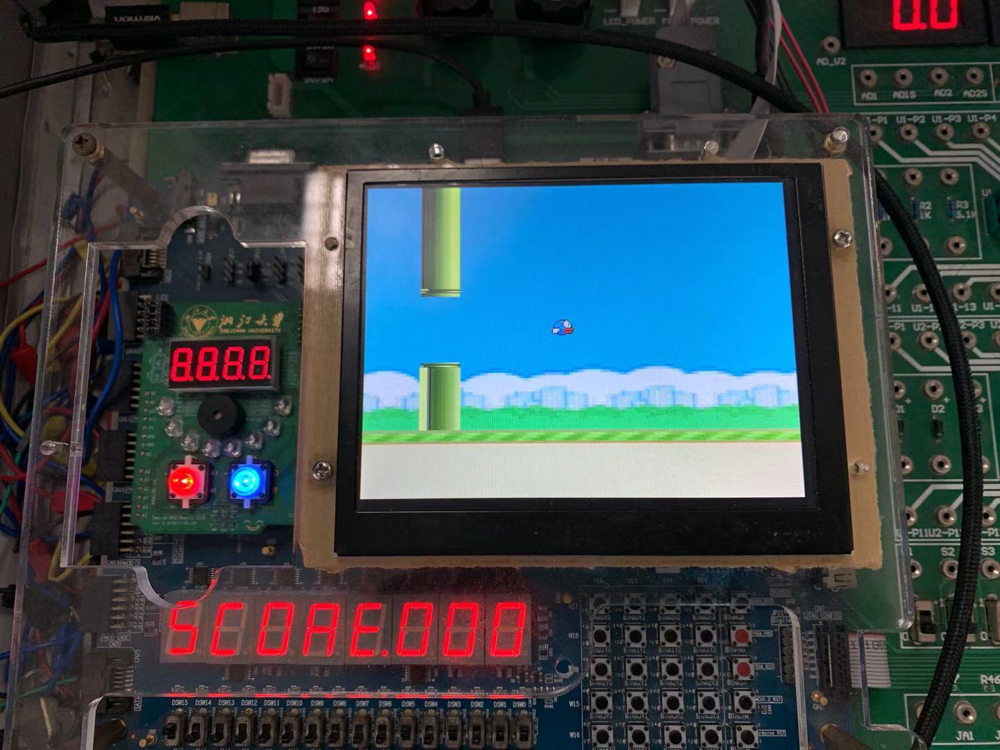

<br/>

<center></center>
<br/>

<center></center>
<br/>
<br/>
<br/>
<br/>

<center style="font-size:2.5rem;font-weight:bold">数字逻辑设计：课程报告</center><br/>
<center style="font-size:2rem;font-weight:bold">基于数字系统的Flappy Bird游戏</center><br/>
<center style="font-size:1.5rem" align = "left">&emsp;&emsp;&emsp;&emsp;&emsp;&emsp;&emsp;&emsp;<b>作者</b>：<u>&ensp;陈希尧&ensp;</u><br/>&emsp;&emsp;&emsp;&emsp;&emsp;&emsp;&emsp;&emsp;<b>学号</b>：<u>&ensp;3180103012&ensp;</u><br/>&emsp;&emsp;&emsp;&emsp;&emsp;&emsp;&emsp;&emsp;<b>专业</b>：<u>&ensp;混合班&ensp;</u><br/>&emsp;&emsp;&emsp;&emsp;&emsp;&emsp;&emsp;&emsp;<b>学院</b>：<u>&ensp;竺可桢学院&ensp;</u></center><br/>
<center style="font-size:1.5rem" align = "left">&emsp;&emsp;&emsp;&emsp;&emsp;&emsp;&emsp;&emsp;<strong>日期</strong>：<u>&ensp;2019年12月26日&ensp;</u></center>
<div STYLE="page-break-after: always;"></div>
<br /><center><font size = "6" color = "0xAAAAEE">目录</font></center><br /><br />

[TOC]

<div STYLE="page-break-after: always;"></div>
<br />

# 第一章-绪论

&emsp;&emsp;Flappy Bird是一款经典的像素风街机游戏，笔者曾经有一段时间着迷于这款游戏并且一直想经自己的设计将其付诸实现。在选择大作业的主题时，考虑到FPGA有限的计算能力，实现一款非常复杂的游戏并不现实，因此像Flappy Bird这样对计算要求有限却能获得很好游戏体验的游戏就成为了我的选择。

&emsp;&emsp;以下部分将着重介绍这个游戏的设计原理、具体的实现，以及实现当中遇到的困难和解决措施。


# 第二章-设计原理与思路

## 2.1 设计原理

1. **VGA显示**

   &emsp;&emsp;VGA(Video Graphics Array)，信号类型为模拟类型，显示卡端的接口为15针母插座.VGA( Video Graphics Array)作为一种标准的显示接口得到了广泛的应用。VGA 在任何时刻都必须工作在某一显示模式之下，其显示模式分为字符显示模式和图形显示模式。而在应用中，讨论的都是图形显示模式。工业标准的 VGA 显示模式为:640\*480\*16色\*60Hz。

   &emsp;&emsp;常见的彩色显示器一般都是 CRT(阴极射线管)构成，其引出线共含 5 个信号:R,G,B(3基色信号),HS(行同步信号),VS(场同步信号).由 R,G,B3 种基色可以组合出任意所要的颜色.在实验的验证阶段可以仅利用 R,G,B3 种基色的一元化值(0 和 1)的不同组合来验证设计的正确性。每一个像素的色彩由 R(红，Red) .G(绿，Green). B(蓝，Blue)三基色构成。显示时采用的是逐行扫描的方式。由VGA 显示模块产生的水平同步信号和垂直同步信号控制阴极射线管中的电子枪产生电子束，轰击涂有荧光粉的屏幕，产生 RGB三基色，于显示屏上合成一个彩色像素点。LCD 显示器虽然显示原理与 CRT 不同，但是控制方式和控制信号却是相同的，所以针对 CRT 设计的控制器也可以应用到 LCD 显小器中。

   &emsp;&emsp;电子束扫描一幅屏幕图像上的各个点的过程称为屏幕扫描。现在显示器都是通过光栅扫描方式来进行屏幕扫描。在光栅扫描方式下，电子束按照固定的路径扫过整个屏幕，在扫描过程中通过电子束的通断强弱来控制电子束所经过的每个点是否显示或显示的颜色，电子枪在 VGA 显示模块产生的行同步、场同步等控制信号的作用下进行包括水平扫描、水平回扫、垂直扫描、垂直回扫等过程。光栅扫描的路径通常为:从上到下扫过每一行，在每一行中从左到右地进行扫描。其过程如下:电子束从屏幕左上角开始向右扫，当到达屏幕的右边缘时，电子束关闭(水平消隐),并快速返回屏幕左边缘(水平回扫)，然后在下一条扫描线上开始新的一次水平扫描。一旦所有的水平扫描均告完成，电子束在屏幕右下角结束并关闭(垂直消隐)，然后迅速返回到屏幕的左上角(垂直回扫)，开始下一次光栅扫描。具体如下：
   
   
   
   &emsp;&emsp;VGA 时序控制模块是本设计的重要部分，最终的输出信号行、场同步信号必须严格按照VGA 时序标准产生相应的脉冲信号。对于普通的 VGA 显示器，其引出线共含 5 个信号:G,R,B(3 基色信号),HS(行同步信号)，VS(场同步信号)。在 5 个信号时序驱动时，时序信号包括前两个，它们都有图像显示区和图像消隐区，图像消隐区又分为消隐前肩、同步脉冲区和消隐后肩。
   
   
   
   
   
   附：VGA模块流程图如下：
   
   ```mermaid
   graph LR
   
   开始(开始)-->数据读入
   数据读入-->扫描["扫描VGA，读取像素点"]
   扫描-->写入["将RGB写入该像素点，导入VGA"]
   写入-->将像素点坐标输出-->数据读入
   ```
   
   **在使用SWORD的VGA显示时，笔者认为有以下几点需多加注意**：
   
   1. VGA的扫描是从屏幕左上角先后经过行/列扫描至屏幕右下角的，因此若与逻辑部分的坐标系不同，可以在输出坐标时即进行坐标变换。
   2. VGA 工业标准显示模式要求：行同步、场同步都为负极性，即同步脉冲要求是负脉冲。
   
2. **状态机的设计**

   &emsp;&emsp;有限状态机（Finite State Machine FSM）是时序电路设计中经常采用的一种方式，尤其适合设计数字系统的控制模块，在一些需要控制高速器件的场合，用状态机进行设计是一种很好的解决问题的方案，具有速度快、结构简单、可靠性高等优点。有限状态机非常适合用 FPGA 器件实现，用 Verilog HDL 的 case 语句能很好地描述基于状态机的设计，再通过 EDA 工具软件的综合，一般可以生成性能极优的状态机电路，从而使其在执行时间、运行速度和占用资源等方面优于用 CPU 实现的方案。
   
   &emsp;&emsp;有限状态机一般包括组合逻辑和寄存器逻辑两部分，寄存器逻辑用于存储状态，组合逻辑用于状态译码和产生输出信号。根据输出信号产生方法的不同，状态机可分为两类：米里型(Mealy)和摩尔型(Moore)。摩尔型状态机的输出只是当前状态的函数。米里型状态机的输出是在输入变化后立即变化的，不依赖时钟信号的同步，摩尔型状态机的输入发生变化时还需要等待时钟的到来，必须在状态发生变化时才会导致输出的变化，因此比米里型状态机要多等待一个时钟周期。
   
3. **硬件描述语言**

   &emsp;&emsp;Verilog HDL 是一种硬件描述语言（HDL:Hardware Description Language），以文本形式来描述数字系统硬件的结构和行为的语言，用它可以表示逻辑电路图、逻辑表达式，还可以表示数字逻辑系统所完成的逻辑功能。
   
   &emsp;&emsp;使用 Verilog 描述硬件的基本设计单元是模块（module）。构建复杂的电子电路，主要是通过模块的相互连接调用来实现的。模块被包含在关键字 module、endmodule 之内。实际的电路元件。Verilog 中的模块类似 C 语言中的函数，它能够提供输入、输出端口，可以实例调用其他模块，也可以被其他模块实例调用。
   
4. **可编程阵列逻辑**
   
   &emsp;&emsp;PAL 器件由可编程的与阵列、固定的或阵列和输出反馈单元组成。不同型号 PAL 器件有不同的可编程阵列逻辑输出和反馈结构，适用于各种组合逻辑电路和时序逻辑电路的设计，是一种可程式化的装置。PLA 具有一组可程式化的 AND 阶，AND 阶之后连接一组可程式化的 OR 阶，如此可以达到：只在合乎设定条件时才允许产生逻辑讯号输出。
   
   &emsp;&emsp;PLA 如此的逻辑闸布局能用来规划大量的逻辑函式，这些逻辑函式必须先以积项（有时是多个积项）的原始形式进行齐一化。在 PLA 的应用中，有一种是用来控制资料路径，在指令集内事先定义好逻辑状态，并用此来产生下一个逻辑状态（透过条件分支）。举例来说，如果目前机器（指整个逻辑系统）处于二号状态，如果接下来的执行指令中含有一个立即值（侦测到立即值的栏位）时，机器就从第二状态转成四号状态，并且也可以进一步定义进入第四状态后的接续动作。因此 PLA 等于扮演（晶片）系统内含的逻辑状态图（state diagram）角色。


## 2.2 设计思路

&emsp;&emsp;最初的规划是使用多个图层表示不同的要素，其中鸟由一个模块进行控制，在一个固定的纵轴上随着操作而上下移动；水管由另一个模块控制，在显示屏上横向移动。每次显示一根水管，水管的高度随机生成。

&emsp;&emsp;鸟的死亡判断与得分判断独立进行，若鸟的像素点落入水管或地面的显示范围内即可认为鸟死亡，而当鸟的最左侧像素与水管的最右侧像素重合时，即可认为由经过了一个管，分数加一。

&emsp;&emsp;当然，随着设计的不断深入，具体的设计思路也在不断更改，但总体符合上述内容。


# 第三章-设计实现

## 3.1 设计大纲

### 3.1.1 整体设计方案

**模块之间关系图**


**工作流程图**


### 3.1.2 显示部分设计细节

**图层设置**

* 设计五个图层，分别显示**提示语**，**鸟**，**地面**，**水管**，**背景**。且这四者按优先级从高到低排列，若优先级高的被显示了，则优先级较低的无法显示。描述如下：

  ```verilog
      // Procedure: prompt > bird > land > pipe > bg, skip the bird
      always @(posedge clk_VGA) begin
          if(state == 2 && inGG && Opacity_GG)
              {BGR_B,BGR_G,BGR_R} <= BGR_GG;
          else if(state == 0 && inReady && Opacity_ready)
              {BGR_B,BGR_G,BGR_R} <= BGR_ready;
          else if(state == 3 && inResume)
              {BGR_B,BGR_G,BGR_R} <= BGR_resume;
          else if(inBird && Opacity_Bird)
              {BGR_B,BGR_G,BGR_R} <= BGR_Bird;
          else if(inLand)
              {BGR_B,BGR_G,BGR_R} <= BGR_Land;
          else if(inPipe && (Opacity_up || Opacity_down)) begin
              if(Y_Addr > pip1_Y && Opacity_down)
                  {BGR_B,BGR_G,BGR_R} <= BGR_downPip;
              if(Y_Addr < pip1_Y - slot_height && Opacity_up)
                  {BGR_B,BGR_G,BGR_R} <= BGR_upPip;
          end
          else
              {BGR_B,BGR_G,BGR_R} <= SW_OK[SW_BG] ? BGR_Night : BGR_Day;
      end
  ```

**图层的透明度显示**

* 本次设计中有些模块不可能以原尺寸显示，必须有一部分作为透明的将显示色让给下一图层，如鸟、水管、"Get Ready"、"Game Over"等等。
* 具体只要对应多加一个名为`inXXX`的变量即可，因为png生成的coe文件均为16位的，其中前四位表示其不透明度。由于生成的IP核必须为2、10或16位的，因此可将不透明度信息一同导入ROM中。在调用时只需将不透明度值为`4'hF`的通通视为透明即可。
* 在显示部分，用`if...else...`语句进行判断，应注意连同透明度信息一同加入判断。

**翅膀的扇动**

* 两种颜色的鸟分为4个状态，利用三张图片往复循环显示实现扇动翅膀的效果

* 状态由`clk_wing`控制，状态图如下：

  ```mermaid
  graph LR
  0("0：翅膀在上")
  1("1：翅膀在中")
  2("2：翅膀在下")
  3("3：翅膀在中")
  0 --> 1 --> 2 --> 3 --> 0
  ```

* 注意：由于三个状态鸟的翅膀位置不同，因此bird这一图层的**颜色信息**和**不透明边界**会随着扇翅的进行而不断变化，因此也需要实时刷新RGB信息和透明度信息。

**图片的缩放**

* 在本实验设计中为了减小.bit文件生成时间与提高游戏的流畅度，对多个图片进行了缩小处理后再生成IP核，因此在调用时需要对图片进行放大操作，由于各图层性质不尽相同，因此放大操作也需个性化定制，主要有以下几个图层( 背景(x4)，地面(x4)，水管(x3)，暂停按钮(x2) )：

  ```Verilog
  // Background
  assign bg_addr = (119 - Y_Addr / 4) * 160 + X_Addr / 4;
  // Land
  assign land_addr = (24 - Y_Addr / 4) * 160 + (X_Addr <= pip1_X ? ((pip1_X - X_Addr) % 640) / 4 : (639 + pip1_X - X_Addr) / 4);
  // Pipe
  assign pip_addr_down = (Y_Addr - pip1_Y) > 35 ? (pip1_X - X_Addr) / 3 : (11 - (Y_Addr - pip1_Y) / 3) * 20 + (pip1_X - X_Addr) / 3;
  assign pip_addr_up = (pip1_Y - slot_height - 1 - Y_Addr) > 35 ? (pip1_X - X_Addr) / 3 + 200 : (pip1_Y - slot_height - 1 - Y_Addr) / 3 * 20 + ((pip1_X - X_Addr) % 640) / 3;
  // Prompt
  assign resume_addr = (268 - Y_Addr) / 2 * 26 + (X_Addr - 295) / 2;
  ```

**地面的移动**

* 实现地面随管一同移动的效果，需要在计算地址时能够实现地面地址的跨边缘计算。这一点的实现只需在计算地面显示对应的ROM读取地址时采用选择语句并且求余保证不溢出即可，实现如下：

  ```verilog
  assign land_addr = (24 - Y_Addr / 4) * 160 + (X_Addr <= pip1_X ? ((pip1_X - X_Addr) % 640) / 4 : (639 + pip1_X - X_Addr) / 4);  // use '%' in case that pip1_X == 639+60 && X_Addr \in [0, 59]
  ```

**分数显示**

* 由于在显示屏上显示分数较为麻烦，因此我想到利用八位七段数码管来显示分数。
* "SCORE"的显示只需对着七段数码管的引脚功能写出对应的电平即可。('R'无法显示，于是将'A'当作'R')
* <u>注意在传递分数给数码管时需先将分数转为BCD编码。</u>


### 3.1.3 逻辑部分设计细节

**鸟的自由落体**

* 考虑到FPGA有限的运算能力，让其进行寄存器的乘法运算来计算鸟的位置(二阶多项式)可能会极大影响游戏流畅度，而为了达到真实的显示效果，鸟的自由落体下落是不可或缺的。

* 因此，笔者采用了伪抛体计算的方法，即：用一个寄存器组存储速度，一个存储方向，另一个存储垂直位置，每次运算采用加减法来改变位置与速度即可避免乘法运算。由于屏幕刷新率较快，肉眼基本分辨不出这种刷新方式与真正的抛体运动的区别。

* 此外有一点需注意，<u>由于这种方式计算的位置是离散变化的，因此当下落速度较快时，鸟有可能落到地表层之下</u>，因此需加入一个中间变量来存储计算获得的鸟的位置并与地面高度比较，若比地面还低，则只能让鸟的位置处在地面高度。

* 具体的下落部分如下：

  ```Verilog
  velocity = velocityDire ? velocity - acceleration : velocity + acceleration;
  V_pos_tmp = velocityDire ? V_pos + velocity : V_pos - velocity;
  V_pos = V_pos_tmp < land_height ? land_height - 1 : V_pos_tmp;
  ```


## 3.2 设计说明

### 3.2.1 重要参数说明

注：<u>在各个模块中同名的参数，为了适应各模块功能，其类型可能不同。</u>

#### 3.2.1.1 逻辑相关参数

**State**

用于记录当前状态，有三个状态(0, 1, 2, 3)，分别表示待开始，游戏中，死亡与暂停，可以以如下条件进行转换。


<u>对于其状态的切换是在顶层模块</u>`Top_FlappyBird`<u>中进行的</u>

**isDead**

在`Bird_Ctrl`中进行死亡判断，并一直传递回顶层模块，用于状态改变。

**Bird_VPos**

用于记录鸟的垂直位置(由于鸟的水平位置是作为`parameter`限定死的，因此不需要单独存储)


#### 3.2.1.2 显示相关参数

**BGR_R, BGR_G, BGR_B**

在Display中是`wire`类型，记录当前像素(行列作标分别为`Y_Addr`, `X_Addr`)处的颜色信息，并传递给`vgac`模块进行颜色显示。

**BGR_XXX(XXX为图层名)**

视具体情况决定是`reg`还是`wire`，分别存储个图层在当前位置的颜色信息，并通过判断，决定将哪一组颜色传给`BGR_R, BGR_G, BGR_B`。

**inXXX(XXX为图层名)**

均为`wire`类型，存储通过逻辑判断当前位置是否落入某一图层的显示域的结果。后续再结合各图层的优先级即可判断当前像素所在图层。

**Opacity_XXX(XXX表示需要透明度显示的图层名)**

均为`wire`型，通过`assign Opacity_XXX = XXX_abandin == 4'hF;`进行赋值(`XXX_abandon`是IP核一个存储单元的前4位数据)，用于表示当前图层在此处是否透明。

**clk_wing**

`reg [1:0]`类型，用于存储当前鸟挥翅膀的状态，状态图如下：


这样既能实现翅膀循环往复扇动的效果，又能防止因意外出现无效转态而导致的锁死。


### 3.2.2 重要模块说明

**Display**

* 控制所有与VGA显示相关的实现，包括图像的生成，鸟和水管的位置的改变等等

**Bird_Ctrl**

* 接受按钮信息，控制鸟的速度大小与方向进而改变其垂直位置并输出回`Display`
* 进行撞击判断鸟是否已死，修改`isDead`并传回`Top`

**Pipe_Generator**

* 在前一根管子完全生成新的管子，并控制这一管子在屏幕上横向移动(通过控制两管间开口的右上角的平移实现)
* 记录已通过的管子数作为分数`score`作为输出回传到`Display`进行显示


# 第四章-调试

## 4.1 仿真测试

1. **Display模块仿真**

   * 验证起飞按钮能否正常地将游戏状态转换

   * 代码如下：

     ```verilog
         integer i = 0;
         initial begin
             state = 0;
             clkdiv = 0;
             SW_OK = 0;
             up_button = 0;
             SW_OK[0] = 1;
             #1000000;
             state = 1;
             
             for(i = 0; i < 30; i = i + 1) begin
                 up_button = 1;
                 #2000;
                 up_button = 0;
                 #1000000;
             end
     
         end
         always #1 clkdiv = clkdiv + 1;
     ```

   * 仿真至10ms的结果图如下：

     

     可以看到按钮第一次按下后，状态即从0转到了1，因此符合设计要求

2. **图像显示IP核仿真**

   * 为了验证生成的IP核是否能够实现功能，对其进行仿真测试。

   * 代码如下：

     ```Verilog
         integer i = 0;
         initial begin
             a = 0;
             for(i = 0; 1; i = i + 1) begin
                 #1; a = a + 1;
             end
         end
     ```

   * 仿真至1μs的结果如下：

     

     可见IP核能正常使用

3. **VGA显示模块仿真**

   * 为了检验该模块的RGB输出是否是与输入的相同，同步性是否正常，进行如下仿真测试。

   * 代码如下：

     ```Verilog
         initial begin
             vga_clk = 0;
             clrn = 0;
             clrn = 1;
             d_in_BGR = 0;
             #100;
             clrn = 0;
             for(d_in_BGR = 0; 1; d_in_BGR = d_in_BGR + 1) begin
                 #20;
             end
         end
         always #1 vga_clk = ~vga_clk;
     ```

   * 仿真至1ms的结果如下：

     
     
     可见该模块的输出即为上一周期给定的输入值，并且行同步与列同步信号也能正常输出。因此模块工作正常。


## 4.2 显示部分物理验证

1. 我第一次上板验证的情况是这样的：

   

   颜色和所调用的图层的颜色是一样的，但是位置和图案显然错误。初步猜测这是由于扫描同步失败导致的，进而检查自己的源码，首先是`vgac`的检查，然而在之前的测试中，`vgac`是可以正常使用的，因此并不是造成事故的原因。

   接着仔细观察图形特征，发现其实是由多个背景图**拼贴**而成，且具体轮廓符合但是**颜色**不对且图片是**倒置**的。经过仔细发现发现三个问题如下：

   1. PNG中图像是以BGR形式存储，因此转成的coe也是BGR的形式，我没有注意到这一点，导致图像的R值与B值反接。
   2. VGA扫描是从上至下、从中扫描，而计算时的XY坐标是从下至上的，因此图像会倒置。
   3. 由于背景图的分辨率仅有160×120，因此计算时需要有相应的缩放处理，我在纵坐标的缩放时出错了，所以导致显示了多张背景图。

2. 解决了上述问题之后，能够正常显示了，但是四个图层中只有最下一层背景能显示，而其他三个部分无法出现，如下图：

   

   仔细检查了`Display`部分代码，发现是犯了漏加如下一处`begin...end`的低级错误，由于漏加这个判断，因此无论前面图层的条件是否成立都会被最后的背景图层覆盖。

   ```verilog
       always @(posedge clk_VGA) begin
           if(inBird && Opacity_Bird)
               {BGR_B,BGR_G,BGR_R} <= BGR_Bird;
           else if(inLand)
               {BGR_B,BGR_G,BGR_R} <= BGR_Land;
           else if(inPipe) /*begin*/
               if(Y_Addr > pip1_Y)
                   {BGR_B,BGR_G,BGR_R} <= BGR_upPip;
               if(Y_Addr < pip1_Y - slot_height)
                   {BGR_B,BGR_G,BGR_R} <= BGR_downPip;
           /*end*/
           else
               {BGR_B,BGR_G,BGR_R} <= SW_OK[SW_BG] ? BGR_Night : BGR_Day;
       end
   ```

   (注：*此时还未加入prompt部分的图层*)

3. 解决了以上问题之后再测试时，管子的显示出现如下异常：

   

   经检查发现这是在计算传给图像ROM的地址时出错导致的，由于本实验中多个图层都涉及了**图像的缩放**(在[3.1.2](#3.1.2 显示部分设计细节)中有详细说明)，因此和容易出现缩放的错误。此处是因为控制水管的图片的ROM的地址大小为20×12的，而显示时将其宽度乘以3扩大到60，缩放没有计算正确而导致的。修改后即可。


## 4.3 逻辑控制物理验证

1. **鸟的控制按钮**

   本来预期功能是按下一次键盘鸟获得一个向上的初速度，但实际上变为按下之后鸟才有下落的反应，并且松开后马上回到未开始的状态。
   
   加入一个状态存储寄存器，在每次时钟沿时用**阻塞赋值**(不能非阻塞)存储`{上一状态, 当前状态}`，之后判断是否为`{松开, 按下}`即可。实现如下：
   
   ```verilog
   always @(posedge clkdiv[20]) begin
       rstState[1] = rstState[0];
       rstState[0] = rst_button;
   end
   ......
   always @(posedge clk) begin
       if(rstState == 2'b01)
       state <= 0;
       ......
   end
   ```
   
2. **死亡后无法初始化的问题**

   发现鸟死后无论怎么按重置按钮鸟都留着不动，发现是状态切换的描述部分没有使用`else if`，这就导致了`state`被置0后由于`isDead`还未来得及清零马上又将`state`置为2，修改之后即可正常使用。

3. **鸟的瞬移问题**

   发现在鸟水平速度为0的瞬间鸟会向下瞬移一定长度。经检查发现是由以下原因共同造成

   * 初始化时给鸟的方向设定是朝上即`velocityDire == 1`
   * 鸟的方向改变语句是`if(velocity == 0 && velocityDire == 1)  velocityDire <= 0;`
   * 鸟的速度(无符号数)改变语句是`velocity <= velocityDire ? velocity - 1 : velocity + 1;`
   * 这个部分的语句均采用非阻塞赋值

   由于是非阻塞赋值，因此鸟的速度变化时`velocityDire`仍为1，因此速度改变语句执行的命令是``velocity <= velocity - 1;`，但由于此时velocity已经为0了，因此会溢出变为有符号的-1即无符号的5'b11111，由于位置改变语句`V_pos <= velocityDire ? V_pos + velocity : V_pos - velocity;`会直接将位置减去速度最大值，因此效果就好像瞬移。

   将初始化的鸟的方向设定为朝下并将该always语句中的赋值语句全部改为非阻塞即可。
   
4. **水管生成问题**

   开始使用了`{$random}`来生成随机的高度，后来发现这一个宏在使用时的返回值始终是0，后来考虑到使用给定的高度值可以避免过于极端的高度值变化情形出现，于是改用`parameter`自定义高度并用`case`语句和一个计数器来给不同的水管赋予不同的高度值。实现如下：

   ```verilog
   parameter rand0 = 281;
   ...
   
   case(rand_state)
       0: pip_Y <= rand0;
       1: pip_Y <= rand1;
       ...
       15: pip_Y <= rand15;
       default: ;
   endcase
   rand_state <= (& rand_state) ? 0 : rand_state + 1;
   ```

5. **鸟向上飞行过高回到地面直接死亡**

   显然这是由于存储高度的寄存器位宽不足导致溢出造成的，增加寄存器位数后可以解决。(但是笔者并没有进行修改，因为游戏本来留出屏幕顶部作为不死亡的区域就是为了给玩家一定的自由度，修改之后可能导致玩家会尝试向上不断飞行而忽视游戏本身)

6. **鸟的初速度与重力加速度设定**

   这部分的设定对玩家的游戏体验有很大的影响。这两个参数的设定与鸟的位置刷新率挂钩，并且这其中存在一个矛盾：<u>刷新率越高，玩家体验越流畅；但同时由于加速度最小值只能设为1，因此鸟的下落加速度会随刷新率增大而不断增大从而增大游戏难度。</u>

   经过反复的尝试，我将刷新周期设为`clkdiv[21]`，初速设为9(pixel/clk)，加速度设为1(pixel/clk^2^)，获得了较好的游戏体验。


# 第五章-效果展示

**颜色切换(背景与鸟的毛色)**

在游戏开始前或游戏中均可通过Switch1切换鸟的毛色，Switch2切换游戏的昼夜背景。

<center></center>
**开始**

按下除了重置键以外的任意按键可以开始游戏，并且鸟会先向上起飞，并且在之后的游戏中也是按任意按键来起飞。


**暂停**

在游戏中将Switch15置位可以暂停游戏，分数和鸟的状态都将保留，直到将Switch15复位再继续游戏。


**扇动效果**

观察可以发现鸟的翅膀是会随时间扇动的，具体可以见视频。

**加速飞行**

将Switch14置位可以进入加速模式，鸟会以原来的两倍水平速度飞行，游戏难度提高，游戏体验也变得更加刺激。

**死亡的坠落**

撞击水管死亡后，鸟会从水管上坠落到地面，并且此时鸟的翅膀已经停止扇动。

<center></center>

**重置游戏**

按下Keypad左上角的按键后，游戏会回到开始界面，同时分数清零。


# 第六章-总结

## 6.1 改进思路

1. **增加鸟的飞翔倾角**

   原游戏中鸟在上升与下降时有不同的倾角(取决于速度的方向)，我在一开始也有这个想法，并已经构想好使用*麦克劳林级数*的方式计算设计所需的三角函数值，无奈我发现由于在Verilog中使用浮点数有些困难(甚至得设计一套自己的浮点数运算体系)，遂放弃了这个想法，我认为将来如果有时间能对这个游戏进行优化我一定会加入这个特性。

2. **增加游戏清晰度**

   设计时为了减少综合生产.bit文件所需的时间，我使用的背景与地面图片分辨率较低，虽然是像素风游戏，但毕竟仔细看还是会觉得不舒服，可以考虑用原图生成的IP核重新设计游戏，增加显示清晰度。


## 6.2 心得

&emsp;&emsp;这次作业的设计算是较为圆满地完成了，并且实现的效果超过我的预期——它游戏体验不亚于原版游戏。

&emsp;&emsp;经过这次大作业的洗礼，我感觉我对硬件设计的熟练度着实增加了不少。HDL有着与从前习惯的软件语言完全不同的设计思路，因此在设计时走了许多弯路，像对于有符号数的减法运算的溢出问题这种在之前的编程中基本没有考虑过的问题在电路的实际设计中就会造成很大影响。

&emsp;&emsp;此外，由于对硬件的很多部分不太熟悉，因此我在debug的时候常常是需要上板一次发现多若干个bug，然后逐一根据物理验证的表现推断错误原因并修改，然后再一次上板逐个核对这些bug是否被解决，这个过程无疑是很花时间的。希望以后能多通过仿真的方式来进行验证。

&emsp;&emsp;最后，还是要感谢两位老师和助教。感谢施老师在课上教授给我们的干货和课后对知识的讨论，洪老师在我们进行实验时的关怀和指导，以及助教耐心的答疑。


# 附录

## 关键源代码

### Top_FlappyBird.v (输入预处理及状态切换)

```Verilog
module Top_FlappyBird(
    input clk,
    input rst,
    input [15:0]SW,
    output [3:0] VGA_R, VGA_G, VGA_B,
    output VGA_hs, VGA_vs,
    output SEGLED_CLK, SEGLED_CLR, SEGLED_DO, SEGLED_PEN,
    output LED_CLK, LED_CLR, LED_DO, LED_PEN,
    inout [4:0]BTN_X,
    inout [3:0]BTN_Y
);
    /* Global Variables*/
    reg [1:0] state = 0;  // 0 is waitForStart; 1 is flying; 2 is dead
    wire [10:0] score;
    wire [11:0] score_BCD;
    reg [31:0]clkdiv;
    wire isDead;
    wire up_button;
    wire SW_pause;
    reg [1:0] rstState;

    always@(posedge clk) begin
        clkdiv <= clkdiv + 1'b1;
    end

    always @(posedge clkdiv[20]) begin
        rstState[1] = rstState[0];
        rstState[0] = keyCode == 5'h0;
    end

    assign up_button = keyReady && rstState == 2'b00;  // Use any button to boost the bird up
    assign SW_pause = SW_OK[15];

    /* Switch */
    wire [15:0] SW_OK;
    AntiJitter #(4) Top_AJ_SW[15:0](.clk(clkdiv[15]), .I(SW), .O(SW_OK) );

    /* Keypad */
    wire [4:0] keyCode;
    wire keyReady;
    Keypad Top_KP(.clk(clkdiv[15]), .keyX(BTN_Y), .keyY(BTN_X), .keyCode(keyCode), .ready(keyReady) );

    /* Segments */
    assign score_BCD[11:8] = score / 100;
    assign score_BCD[7:4]  = (score - score_BCD[11:8] * 100) / 10;
    assign score_BCD[3:0]  = score % 10;

    Seg7Device Top_S7Device(.clkIO(clkdiv[3]), .clkScan(clkdiv[15:14]), .clkBlink(clkdiv[25]),
        .data({20'b0,score_BCD}), .point(8'h0), .LES(8'h0), .sout({SEGLED_CLK,SEGLED_DO,SEGLED_PEN,SEGLED_CLR}) );

    
    ShiftReg #(.WIDTH(16)) LED_m0 (.clk(clkdiv[3]), .pdata(~SW_OK), .sout({LED_CLK,LED_DO,LED_PEN,LED_CLR}));

    /* Switch state */
    always @(posedge clk) begin
        if(rstState == 2'b01)
            state <= 0;
        else if(isDead)
            state <= 2;
        else if(SW_pause)
            state <= 3;
        else if(state == 0 && up_button || state == 3 && !SW_pause)
            state <= 1;
    end

    /* VGA Display */
    Display DP_m0(.state(state), .clkdiv(clkdiv), .SW_OK(SW_OK), .up_button(up_button),
        .VGA_R(VGA_R), .VGA_G(VGA_G), .VGA_B(VGA_B), .VGA_hs(VGA_hs), .VGA_vs(VGA_vs) ,.score(score), .isDead(isDead) );
endmodule
```

### Display.v (控制所有显示)

```verilog
module Display(
    input [1:0] state,
    input [31:0] clkdiv,
    input [15:0] SW_OK,
    input up_button,
    output VGA_hs, VGA_vs,
    output isDead,
    output [3:0] VGA_R, VGA_G, VGA_B,
    output [7:0] score
    );

    parameter pip_COLOR   = 12'h0C0;
    parameter bird_HPos   = 320;
    parameter bird_Xwidth = 34;
    parameter bird_Ywidth = 24;
    parameter slot_width  = 60;
    parameter slot_height = 100;
    parameter land_height = 100;
    parameter SW_VGA      = 0;
    parameter SW_Bird     = 1;
    parameter SW_BG       = 2;

    wire clk_VGA;
    wire [12:0]  bird_VPos;
    wire [11:0] BGR_Land;
    wire [9:0] X_Addr;
    wire [8:0] Y_Addr;
    wire [9:0] pip1_X;
    wire [8:0] pip1_Y;
    wire inBird, inLand, inPipe;
    wire SW_speed;
    reg [3:0]  BGR_R,BGR_G,BGR_B;
    reg [11:0] BGR_Bird;
    reg Opacity_Bird;

    assign clk_VGA  = clkdiv[1];
    assign SW_speed = SW_OK[14];

    /* Core Control Part */
    Bird_Ctrl BC_m0(.clk_ms(clkdiv[21]), .up_button(up_button), .state(state), .pip1_X(pip1_X), .pip1_Y(pip1_Y),
        .V_pos(bird_VPos), .isDead(isDead) );
    Pipe_Generator PG_m0(.clk_2ms(SW_speed ? clkdiv[17] : clkdiv[18]), .state(state),
       .pip_X(pip1_X), .pip_Y(pip1_Y), .score(score) );
    
    /* BackGround */
    wire [14:0] bg_addr;
    wire [11:0] BGR_Day, BGR_Night;
    wire [3:0] day_abondon, night_abondon;
    assign bg_addr = (119 - Y_Addr / 4) * 160 + X_Addr / 4;
    bg_day_160_120 BG_day_m0(.a(bg_addr), .spo({day_abondon, BGR_Day}) );
    bg_night_160_120 BG_night_m0(.a(bg_addr), .spo({night_abondon, BGR_Night}) );

    /* Land, regard pip1_X as 0 */
    wire [11:0] land_addr;
    wire [3:0] land_abandon;
    assign inLand = Y_Addr < 100;
    assign land_addr = (24 - Y_Addr / 4) * 160 + (X_Addr <= pip1_X ? ((pip1_X - X_Addr) % 640) / 4 : (639 + pip1_X - X_Addr) / 4);  // use '%' in case that pip1_X == 639+60 && X_Addr \in [0, 59]
    bg_land_160_25 Land_m0(.a(land_addr), .spo({land_abandon, BGR_Land}));

    /* Pipe: Right-Up Side */
    wire [7:0] pip_addr_up, pip_addr_down;
    wire [11:0] BGR_upPip, BGR_downPip;
    wire [3:0] pU_abandon, pD_abandon;
    wire Opacity_up, Opacity_down;

    assign inPipe = (Y_Addr >= pip1_Y || Y_Addr < pip1_Y - slot_height) && (X_Addr > pip1_X - slot_width || pip1_X < slot_width) && X_Addr <= pip1_X;  // in case of overflow that flush the pipe
    assign pip_addr_down = (Y_Addr - pip1_Y) > 35 ? (pip1_X - X_Addr) / 3 : (11 - (Y_Addr - pip1_Y) / 3) * 20 + (pip1_X - X_Addr) / 3;
    assign pip_addr_up = (pip1_Y - slot_height - 1 - Y_Addr) > 35 ? (pip1_X - X_Addr) / 3 + 200 : (pip1_Y - slot_height - 1 - Y_Addr) / 3 * 20 + ((pip1_X - X_Addr) % 640) / 3;  // use '%' in case that pip1_X == 639+60 && X_Addr \in [0, 59]

    pipe_down_20_12 PD_m0(.a(pip_addr_down), .spo({pD_abandon, BGR_downPip}));
    pipe_up_20_12   PU_m0(.a(pip_addr_up),   .spo({pU_abandon, BGR_upPip}));
    assign Opacity_up = pU_abandon == 4'hF;
    assign Opacity_down = pD_abandon == 4'hF;

    /* Bird: Right_Down Side */
    wire [3:0] bird_opacity_00, bird_opacity_01, bird_opacity_02, bird_opacity_10, bird_opacity_11, bird_opacity_12;
    wire [11:0] bird_BGR_00, bird_BGR_01, bird_BGR_02, bird_BGR_10, bird_BGR_11, bird_BGR_12;
    wire [9:0] bird_addr;
    assign inBird = Y_Addr >= bird_VPos && Y_Addr < bird_VPos + bird_Ywidth && X_Addr <= bird_HPos && X_Addr > bird_HPos - bird_Xwidth;
    assign bird_addr = inBird ? bird_Xwidth * (bird_VPos + bird_Ywidth - 1 - Y_Addr) + (X_Addr - (bird_HPos - bird_Xwidth + 1)) : 0;
    bird0_0 BG_B00_m0(.a(bird_addr), .spo({bird_opacity_00, bird_BGR_00}));
    bird0_1 BG_B01_m0(.a(bird_addr), .spo({bird_opacity_01, bird_BGR_01}));
    bird0_2 BG_B02_m0(.a(bird_addr), .spo({bird_opacity_02, bird_BGR_02}));
    bird1_0 BG_B10_m0(.a(bird_addr), .spo({bird_opacity_10, bird_BGR_10}));
    bird1_1 BG_B11_m0(.a(bird_addr), .spo({bird_opacity_11, bird_BGR_11}));
    bird1_2 BG_B12_m0(.a(bird_addr), .spo({bird_opacity_12, bird_BGR_12}));
    reg [1:0] clk_wing = 0;    // For wing shaking
    always @(posedge clkdiv[22])
        if(state != 2)
            clk_wing = clk_wing == 3 ? 0 : clk_wing + 1;

    always @(clk_wing) begin
        case(clk_wing)
            0: begin
                Opacity_Bird <= SW_OK[SW_Bird] ? bird_opacity_10 : bird_opacity_00;
                BGR_Bird <= SW_OK[SW_Bird] ? bird_BGR_10 : bird_BGR_00;
            end
            1, 3: begin
                Opacity_Bird <= SW_OK[SW_Bird] ? bird_opacity_11 : bird_opacity_01;
                BGR_Bird <= SW_OK[SW_Bird] ? bird_BGR_11 : bird_BGR_01;
            end
            2: begin
                Opacity_Bird <= SW_OK[SW_Bird] ? bird_opacity_12 : bird_opacity_02;
                BGR_Bird <= SW_OK[SW_Bird] ? bird_BGR_12 : bird_BGR_02;
            end
            default: ;
        endcase
    end

    /* Prompt */
    wire [13:0] GG_addr, ready_addr;
    wire [9:0] resume_addr;
    wire [3:0] GG_abandon, ready_abandon, resume_abandon;
    wire [11:0] BGR_GG, BGR_ready, BGR_resume;
    wire Opacity_GG, Opacity_ready;
    wire inGG, inReady, inResume;
    assign inGG = X_Addr > 218 && X_Addr <= 422 && Y_Addr > 213 && Y_Addr <= 267;
    assign inReady = X_Addr > 222 && X_Addr <= 418 && Y_Addr > 289 && Y_Addr <= 351;
    assign inResume = X_Addr > 294 && X_Addr <= 346 && Y_Addr > 212 && Y_Addr <= 268;

    assign GG_addr = 204 * (267 - Y_Addr) + (X_Addr - 219);
    assign ready_addr = 196 * (351 - Y_Addr) + (X_Addr - 223);
    assign resume_addr = (268 - Y_Addr) / 2 * 26 + (X_Addr - 295) / 2;

    GG_204_54 GG_m0(.a(GG_addr), .spo({GG_abandon, BGR_GG}));
    ready_196_62 ready_m0(.a(ready_addr), .spo({ready_abandon, BGR_ready}));
    resume_26_28 resume_m0(.a(resume_addr), .spo({resume_abandon, BGR_resume}));
    assign Opacity_GG = GG_abandon == 4'hF;
    assign Opacity_ready = ready_abandon == 4'hF;


    // Procedure: prompt > bird > land > pipe > bg, skip the bird
    always @(posedge clk_VGA) begin
        if(state == 2 && inGG && Opacity_GG)
            {BGR_B,BGR_G,BGR_R} <= BGR_GG;
        else if(state == 0 && inReady && Opacity_ready)
            {BGR_B,BGR_G,BGR_R} <= BGR_ready;
        else if(state == 3 && inResume)
            {BGR_B,BGR_G,BGR_R} <= BGR_resume;
        else if(inBird && Opacity_Bird)
            {BGR_B,BGR_G,BGR_R} <= BGR_Bird;
        else if(inLand)
            {BGR_B,BGR_G,BGR_R} <= BGR_Land;
        else if(inPipe && (Opacity_up || Opacity_down)) begin
            if(Y_Addr > pip1_Y && Opacity_down)
                {BGR_B,BGR_G,BGR_R} <= BGR_downPip;
            if(Y_Addr < pip1_Y - slot_height && Opacity_up)
                {BGR_B,BGR_G,BGR_R} <= BGR_upPip;
        end
        else
            {BGR_B,BGR_G,BGR_R} <= SW_OK[SW_BG] ? BGR_Night : BGR_Day;
    end

    vgac vgac_m0(
        .vga_clk(clk_VGA), .clrn(~SW_OK[SW_VGA]), .d_in_BGR({BGR_B,BGR_G,BGR_R}),
        .Y_Addr(Y_Addr), .X_Addr(X_Addr),
        .r(VGA_R), .g(VGA_G), .b(VGA_B), .hs(VGA_hs), .vs(VGA_vs)
    );

endmodule
```

### Bird_Ctrl.v (控制鸟移动)

```verilog
module Bird_Ctrl(
    input clk_ms, up_button,
    input [1:0] state,
    input [9:0] pip1_X,
    input [8:0] pip1_Y,
    output isDead,
    output reg [12:0] V_pos
    );

    parameter initialVelocity = 9;  // Velocity after up_button, MIST BE THE MULTIPLE OF `acceleration`
    parameter acceleration    = 1;   // Acceleration of gravity
    parameter H_pos       = 320;
    parameter slot_width  = 60;
    parameter slot_height = 100;
    parameter land_height = 100;
    parameter bird_Xwidth = 34;
    parameter bird_Ywidth = 24;

    reg [12:0] time_from = 0;       // Unit: clk_fly, max 8*1024 clk_fly
    reg [5:0] velocity = 0;         // Unit: pixels/ms, max 64 pixels/clk_fly
    reg velocityDire = 0;           // 1:up 0:down

    reg [3:0] angle;
    reg [1:0] button_state = 2'b00;
    reg [8:0] V_pos_tmp = 0;

    assign isDead = state && (V_pos < land_height || H_pos - 2 > pip1_X - slot_width + 1 && H_pos - bird_Xwidth + 4 < pip1_X && (V_pos + bird_Ywidth - 2 > pip1_Y || V_pos + 2 < pip1_Y - slot_height));

    always @(posedge clk_ms) begin
        // button_state = {button_state[0], up_button};
        button_state[1] = button_state[0];
        button_state[0] = up_button;
        case(state)
            0: begin
                V_pos  = 240;
                velocity = 0;
                velocityDire = 0;
            end
            1: begin
                if(button_state == 2'b01) begin
                    velocity = initialVelocity;
                    velocityDire = 1;
                end
                if(velocity == 0 && velocityDire == 1)
                    velocityDire = 0;

                velocity = velocityDire ? velocity - acceleration : velocity + acceleration;
                V_pos_tmp = velocityDire ? V_pos + velocity : V_pos - velocity;
                V_pos = V_pos_tmp < land_height ? land_height - 1 : V_pos_tmp;
            end
            2: begin  // Falling down to ground
                velocity = velocityDire ? 0 : velocity + acceleration * 2;
                velocityDire = 0;
                V_pos_tmp = V_pos - velocity;
                V_pos = V_pos_tmp < land_height ? land_height - 1 : V_pos_tmp;
            end
            default: ;
        endcase
    end

endmodule
```

### Pipe_Generator.v (控制水管生成及移动)

```verilog
module Pipe_Generator(
    input clk_2ms,
    input [1:0] state,
    output reg [9:0] pip_X,  // [0, 640+slot_width]
    output reg [8:0] pip_Y,  // [slot_height, 480]
    output reg [7:0] score
    );

    parameter slot_width   = 60;
    parameter slot_height  = 100;
    parameter bird_HPos    = 320;
    parameter bird_Xwidth  = 34;
    // parameter pip_Vpos_buf = 20;
    parameter rand0 = 281;  // Generated using C
    parameter rand1 = 307;
    parameter rand2 = 374;
    parameter rand3 = 340;
    parameter rand4 = 409;
    parameter rand5 = 364;
    parameter rand6 = 318;
    parameter rand7 = 398;
    parameter rand8 = 402;
    parameter rand9 = 304;
    parameter rand10 = 345;
    parameter rand11 = 385;
    parameter rand12 = 321;
    parameter rand13 = 267;
    parameter rand14 = 401;
    parameter rand15 = 331;
    

    reg [3:0] rand_state = 0;

    always @(posedge clk_2ms) begin
        case(state)
            0: begin
                    pip_X <= 0;
                    score <= 0;
            end
            1: begin
                if(pip_X == bird_HPos - bird_Xwidth)
                    score <= score + 1;
                if(pip_X == 0) begin
                    pip_X <= 639 + slot_width + 24;  // The land width is 11x4 pixels
                    case(rand_state)
                        0: pip_Y <= rand0;
                        1: pip_Y <= rand1;
                        2: pip_Y <= rand2;
                        3: pip_Y <= rand3;
                        4: pip_Y <= rand4;
                        5: pip_Y <= rand5;
                        6: pip_Y <= rand6;
                        7: pip_Y <= rand7;
                        8: pip_Y <= rand8;
                        9: pip_Y <= rand9;
                        10: pip_Y <= rand10;
                        11: pip_Y <= rand11;
                        12: pip_Y <= rand12;
                        13: pip_Y <= rand13;
                        14: pip_Y <= rand14;
                        15: pip_Y <= rand15;
                        default: ;
                    endcase
                    //pip_Y <= slot_height + pip_Vpos_buf + {$random} % (480 - slot_height - pip_Vpos_buf);
                    rand_state <= (& rand_state) ? 0 : rand_state + 1;
                end
                else
                    pip_X <= pip_X - 1;
            end
            default:begin
                pip_X <= pip_X; pip_Y <= pip_Y;
            end
        endcase
    end
endmodule
```

### vgac.v (控制VGA显示)

```verilog

module vgac(input     [11:0] d_in_BGR,   // bbbb_gggg_rrrr, pixel
            input            vga_clk,    // 25MHz
            input            clrn,       // Clear the screen
            output reg [8:0] Y_Addr,     // pixel ram Y address, 480 (512) lines
            output reg [9:0] X_Addr,     // pixel ram X address, 640 (1024) pixels
            output reg [3:0] r,g,b,      // red, green, blue colors
            output           read,       // read pixel RAM (active_high)
            output reg       hs,vs       // horizontal and vertical synchronization
            );

    // X_count: VGA horizontal counter (0-799)
    reg [9:0] X_count;           // VGA horizontal counter (0-799): pixels
    always @ (posedge vga_clk) begin
        if (clrn) begin
            X_count <= 10'h0;
        end else if (X_count == 10'd799) begin
            X_count <= 10'h0;
        end else begin 
            X_count <= X_count + 10'h1;
        end
    end

    // Y_count: VGA vertical counter (0-524)
    reg [8:0] Y_count; // VGA vertical   counter (0-524): lines
    always @ (posedge vga_clk/* or negedge clrn*/) begin
        if (clrn) begin
            Y_count <= 10'h0;
        end else if (X_count == 10'd799) begin
            if (Y_count == 10'd524) begin
                Y_count <= 10'h0;
            end else begin
                Y_count <= Y_count + 10'h1;
            end
        end
    end

    // signals, will be latched for outputs
    wire  [8:0]  Y_tmp  =  Y_count - 10'd35;     // pixel ram Y addr 
    wire  [9:0]  X_tmp  =  X_count - 10'd143;    // pixel ram X addr 
    wire         X_sync = (X_count > 10'd95);    //  96 -> 799
    wire         Y_sync = (Y_count > 10'd1);     //   2 -> 524
    assign       read   = (X_count > 10'd142) && // 143 -> 782
                          (X_count < 10'd783) && //        640 pixels
                          (Y_count > 10'd34)  && //  35 -> 514
                          (Y_count < 10'd515);   //        480 lines
    // vga signals
    always @ (posedge vga_clk) begin
        Y_Addr <=  479 - Y_tmp;        // pixel ram Y address
        X_Addr <=  X_tmp;        // pixel ram X address
        // rdn      <= ~read;         // read pixel (active low)
        hs     <=  X_sync;       // horizontal synchronization
        vs     <=  Y_sync;       // vertical   synchronization
        r      <=  read ? d_in_BGR[3:0]  : 4'b0;  // 4-bit red
        g      <=  read ? d_in_BGR[7:4]  : 4'b0;  // 4-bit green
        b      <=  read ? d_in_BGR[11:8] : 4'b0;  // 4-bit blue
    end
endmodule
```